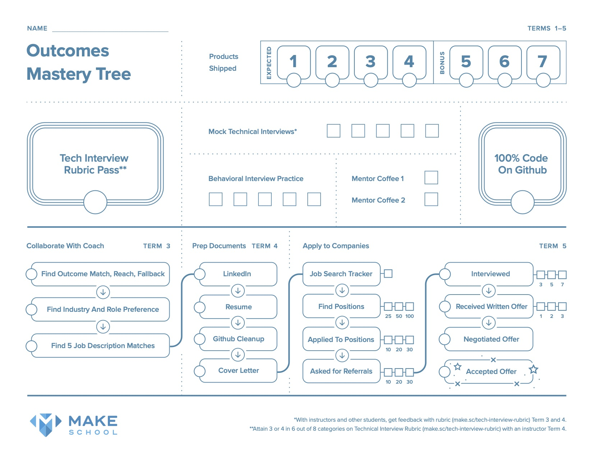

Let’s face it. The job search is challenging. The following tutorial will ensure you increase your focus, motivation, effectiveness, and fun while pursuing your job search! We want you be as prepared as possible.

## Why Is This Important?

We do **not** want this to be your interview! It's important that you show up well to your interviews, and the best way to do that is to make sure you're prepared long before the interview takes place.

Often times it's hard to even land that first interview, so we want to make sure you're ready for that as well. **Bottom Line: following this tutorial will boost your confidence, and increase your chances of getting that interview!**

# Learning Outcomes

By the end of this tutorial, you should be able to...

1. Understand the outcomes mastery tree at Make School
1. Create a contact management system
1. Search for roles that match your skillset and interests
1. Find and foster "warm connections"
1. Write to cold/warm connections and recruiters
1. Fill out job applications

>[action]
>
> Take a moment to write down these learning outcomes and reflect on them. Make sure that as you progress through the tutorial that you're furthering your understanding, and that by the end, you have completed all of the outcomes.

# Outcomes Mastery Tree

Above is the Make School Outcomes Mastery Tree. Think of this as your roadmap to getting that job offer by the end of your time here at Make School. Here's how to read the tree:

1. The top half of the document (above that first solid line) are items to be completed in your first year at Make School (Terms 1-5 of Junior year). Note the "*" footnotes and read them as they specify what terms the Mock Technical Interviews and Tech Interview Rubric Pass should happen.
1. Terms 1-2 of senior year have the industry collaboration project in SPD, so you'll be using that time to build your portfolio, and build your network through your industry partner
1. The bottom half of the tree show the steps that need to be taken in Terms 3-5 of Senior year in order to secure a job by graduation.
1. Lastly, don't feel limited by this tree. If you happen to move ahead, and complete steps ahead of time, that's fantastic! But if not, no worries at all, as long as you keep in line with the timeline as given  by this tree.

> [action]
>
> [Download your own copy of the tree](https://drive.google.com/file/d/0B5OY6XRGtYXpZEljVUlTWVdScnc/view?usp=sharing) and start filling it in with where you're at so far.

# Company and Role Fit Rubric: Finding Your Match

It's time to start thinking about what kind of role would best suit you! There's lots of different engineering roles out there, at lots of different types of companies! There's also no right answer to this. While skill-level definitely plays a role, your decision is also going to be based a lot on personal preference. Some people prefer a smaller company over a bigger one, or vice versa. Both are absolutely fine!

What's _not_ fine is not knowing your path, so we're here to help you with that!

> [action]
>
> [Create a copy of this rubric](https://docs.google.com/document/d/1bnvGp0CM30y-N3K463zg3lGXSt3q8mWoASCko0x1uKk/edit) using File --> Make a Copy. From there, begin filling it out to find your Match, Reach, and Fallback roles, and then name at least 3 companies that would fall into each of those roles.

If you have questions around this, or need help filling it out, talk to your SPD instructor or coach!

> [info]
>
> We will revisit Match/Fallback/Reach in chapter 3 in more detail. For now just get a baseline!

# Great Work!

Congrats on taking the first steps into navigating your job search! Setting down this foundation now will make navigating the rest of this tutorial much easier, so make sure to take the time to properly fill out the two items above before you move on.
