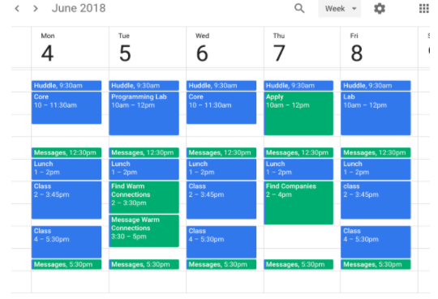

> [info]
>
> **IMPORTANT NOTE:** You may see reference to a website called app.jobtracker.io in some of these videos. Rather than using that, please utilize the [Contact Management Tool](https://docs.google.com/spreadsheets/d/18T7xSIWxxOkWbGImLqHiOflepw2S6h-cM-1y4l9zrjQ/edit#gid=1184999698) from chapter 2 to fill in the information you find!

Alright the time has come!

Time to take all your diligent prep work and apply it to...well, applications!

Alright let's get into it

# Make School's Job Application Process

> [action]
>
> Watch this quick video that describes Make School's 5-step process for job applications. Note that instead of using JobTracker, utilize the Applications tab in your Contact Management Tool to achieve the same result.
>
> 

Here's that process described in the video outlined below. Yes this will be more work to do, but you'll get far better results!

**Apply:**

1. Submit job application via site (use your personal email)
1. See if you have any 1st degree connections (shows on LinkedIn) at the company who can refer you to a recruiter at the company.
1. Connect with warm leads (friend there, friend of friend, Make School staff) to forward an email you write (use [these templates](https://docs.google.com/document/d/13JGarODrfhwkuPGP2OY8oGQ8nxtaloNQnClrocCNM6A/edit#heading=h.ihr6aoyc784g) or [this one](https://docs.google.com/document/d/1FD52I6tKofC1zpZyLWmX1BCQw5WDPkmzimvDSK_E_nM/edit#heading=h.7noej9mqhlr6)) for the warm contact to forward to their recruitment manager
1. Send a cover letter to a recruiter (find recruiter, Head of Technical Recruiting, or University Recruiter via LinkedIn) and confirm they’ve received it.

**Follow-up:**

1. After applying, follow up _every week_ to ask for an update in the process. Utilize the [follow up message templates](https://docs.google.com/document/d/13JGarODrfhwkuPGP2OY8oGQ8nxtaloNQnClrocCNM6A/edit#heading=h.m75g4qvq3p61) to get started
1. _(Bonus step!)_ Send recruiters updates if you ship a product or have any other achievements as a way to make contact and show progress

# Weekly Regimen

Ok we have our process, now let's apply it using the 10-10-10 routine.

The **10-10-10 Routine** refers to the following tasks you will do each week:

- reach out to 10 recruiters
- reach out to 10 engineers
- apply to 10 jobs

Each and every week you will aim to hit these objectives. If this seems like a lot, remember the Job Offer Calculator you did earlier. Interviewing is a marathon, not a sprint, so pace yourself accordingly.

> [action]
>
> Take some time to read over the [10-10-10 Routine doc](https://docs.google.com/document/d/1FU87xMzU4r7wHrOL0aadP70vcgVdX1FS8HPpzFb-Ulk/edit?usp=sharing). There are lots of resources and templates in there to use for reaching out to people.
>
> As you go through this weekly routine, use the 5-step process we outlined before for each job application!

# Post-Application

This process can get overwhelming, so it's important to block off dedicated time for it, especially as you start getting more involved in the process.

> [action]
>
> Every week ...
>
> 1. **Schedule job search related work to your calendar:**
>     1. 1-hour “phase time block” to do one of the phases above to grow your job funnel
>     1. **Create a ½-hour “messaging time block”** to respond to incoming messages (always respond in less than 24 hours). Schedule before lunch and before they go home because if you schedule in mid-day you can get lost in the email rabbit hole.
> 1. **Get help** from instructors and community on issues, concerns, ideas, worries, or blockers
>     1.Slack your coach
>     1. Slack the Student Experience Manager and Outcomes Manager
>     1. Go to job search office hours
> 1. **Share (and celebrate) interviews and offers with instructors!** And log them into the Applications tab of your Contact Management Tool
> 1. **Use your Contact Management Tool** to …
>     1. Log new contacts you make at companies
>     1. Set follow up reminder to check in with recruiters if they don’t respond
>     1. Update status at a company
> 1. **Schedule an hour each week to plan** how you will allocate your time for the week:
> 

## Negotiating and Signing offers

When you recieve your offer letter, we'll go into the final phase: negotiating! Rarely is it in your benefit to not negotiate for a higher salary, and doing so could net you a 10-20% increase to your starting pay, a signing bonus, or more! Not negotiating is leaving money on the table, and allowing the company to pay you the lowest that they think you'll accept. Show them you know your value!

> [action]
>
> Read up on our [tips to negotiating](https://docs.google.com/document/d/12oqw1tXTSw5FJduDT8Q46WYW7dGp5Dp39QKK-xuYGR4/edit), and when the time comes, reach out to the Student Experience Manager, and the Outcomes Manager who can help you with specific steps for your situation!

# Feedback and Review - 2 minutes

**We promise this won't take longer than 2 minutes!**

Please take a moment to rate your understanding of the learning outcomes from this tutorial, and how we can improve it via our [tutorial feedback form](https://forms.gle/wgVdAJnZcybDfNfV9)

This allows us to get feedback on how well the students are grasping the learning outcomes, and tells us where we can improve the tutorial experience.

# Congrats!!

You have submitted your first batch of job applications by now, and that is something to be proud of! This tutorial will be updated as more content is added, so check back and refresh when you use it so you can get the newest guides and tips!
